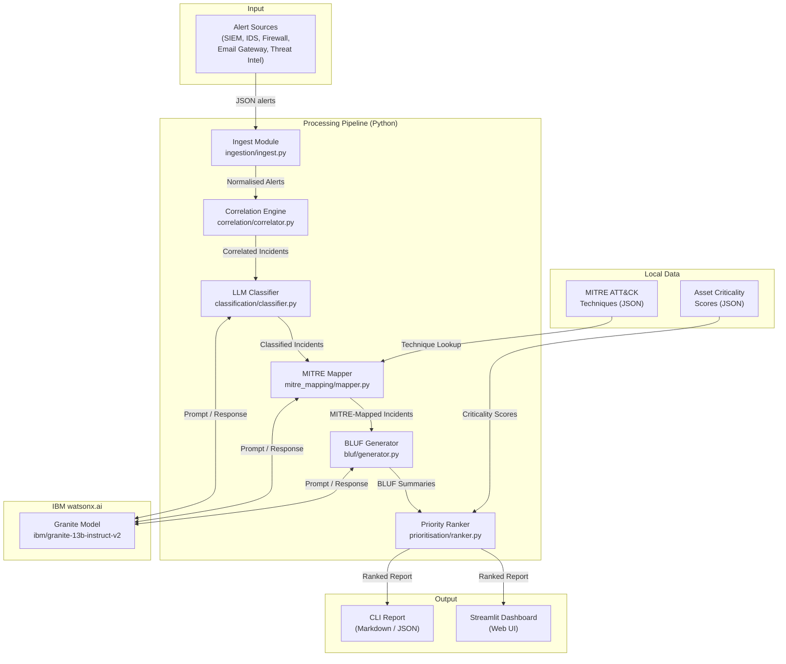

# Architecture

## System Architecture

## Components

| Component | Technology | Responsibility |
|---|---|---|
| Alert Ingestion | Python (json, dataclasses) | Load raw alerts from JSON, normalise fields (timestamps, IPs, severity) |
| Correlation Engine | Python (rule-based algorithm) | Group related alerts into incidents using IP pairs + time windows |
| LLM Client | `ibm-watsonx-ai` SDK / `anthropic` SDK | Abstraction layer for calling watsonx.ai or Anthropic Claude |
| Threat Classifier | Python + LLM prompts | Classify each incident as genuine threat or false positive |
| MITRE Mapper | Python keyword matching + LLM | Map incidents to MITRE ATT&CK techniques (hybrid approach) |
| BLUF Generator | Python + LLM prompts | Generate military-format intelligence summaries |
| Priority Ranker | Python (weighted scoring) | Rank incidents by severity, confidence, asset criticality, alert density |
| CLI | Python (`click` library) | Command-line interface for batch processing |
| Web Dashboard | Streamlit | Interactive 3-tab UI: Alert Feed, Incidents, BLUF Reports |
| Local Data | JSON files | MITRE ATT&CK subset (30 techniques) + asset criticality lookup (12 assets) |

## Data Flow

1. **Ingestion:** Raw alerts (JSON) are loaded and normalised into `Alert` dataclass objects. Timestamps are parsed, severity levels standardised to a 4-level scale.

2. **Correlation:** Alerts are grouped into `Incident` objects using a 3-pass rule-based algorithm:
   - Pass 1: Group by (source_ip, dest_ip) pair, split by time gaps
   - Pass 2: Merge groups sharing destination IP within time window
   - Pass 3: Merge groups sharing source IP within time window

3. **Classification:** Each incident is sent to the watsonx.ai Granite model with a structured prompt. The model returns a JSON response with classification (genuine/false positive), confidence (0-100), and reasoning.

4. **MITRE Mapping:** Two-stage: keyword matching against local MITRE JSON, then LLM refinement to select best-fit techniques.

5. **BLUF Generation:** Each incident (with classification + MITRE data) is sent to the LLM to produce a BLUF-format summary.

6. **Prioritisation:** Weighted scoring formula ranks incidents. Genuine threats rank above false positives.

7. **Output:** Rendered as Markdown report (CLI) or interactive dashboard (Streamlit).

## Security Considerations

- API keys (watsonx, Anthropic) stored in `.env` files, never committed to git (`.gitignore` enforced)
- No real security data processed — synthetic alerts only
- LLM prompts do not contain PII or classified information
- The tool is a prototype; production deployment would need authentication, audit logging, and encrypted API calls

## Scalability Notes

- **Current scope:** ~200 alerts processed in under 2 minutes (limited by LLM API latency, not compute)
- **Bottleneck:** LLM API calls (3 calls per incident × ~2-5 seconds each). Could be parallelised with async requests.
- **Scaling path:** For production, batch classification prompts, use watsonx.ai's batch inference API, and cache MITRE keyword matches. The correlation engine itself is O(n log n) and handles thousands of alerts in milliseconds.
